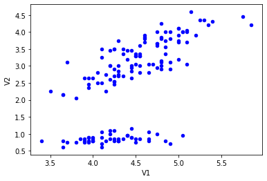
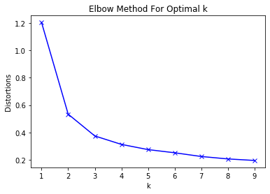
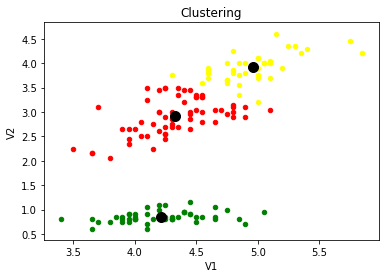

# ACM Research Coding Challenge (Fall 2020)

## Libraries
<strong>import pandas</strong>: To read CSV data. 
<strong>import matplotlib.pyplot</strong>: To graph results. 
<strong>from scipy.spatial.distance import cdist</strong>: To compute Euclidean distance between points to classify a point into a cluster. 
<strong>from sklearn.cluster import KMeans</strong>: To partitioning data points into a set of k groups. 
<strong>import numpy as np</strong>: To work with arrays in Python. 

## Functions
### readData()
Reads data from CSV file, plots current dataset, returns V1 and V2 column set as new Pandas DataFrame
 

### elbowMethod(data)
Takes Pandas DataFrame, with V1 and V2 columns, as a parameter and uses Elbow Method to determine the number of clusters  
For each sample value of k, I'm calculating the average of the squared distances from the cluster centers of the respective clusters, storing the results in distortions list. 
Then I used the values in the distortion list to identify the 'bend' in the graph to determine the value for the number of clusters

### clustering(data)
Takes Pandas DataFrame, with V1 and V2 columns, as a parameter and uses the KMeans algorithm to group data points based on the number of clusters
  
Algorithm: 
Starts with randomly selected centroids(for each cluster), then performs repetitive calculations to optimize for best positions of the centroid. Then performs calculations to categorize points in the dataset  into a cluster.

## Results
### Dataset Graph

### Elbow Graph
From the graph, we can infer that the 'bend' occurs at k=3, therefore, number of clusters = 3

### Cluster Graph
Black Mark: Centroid for respective cluster

## Sources
To Find optimal Clusters (Elbow Method):
https://pythonprogramminglanguage.com/kmeans-elbow-method/
 
To perform KMeans clustering: 
https://towardsdatascience.com/understanding-k-means-clustering-in-machine-learning-6a6e67336aa1
